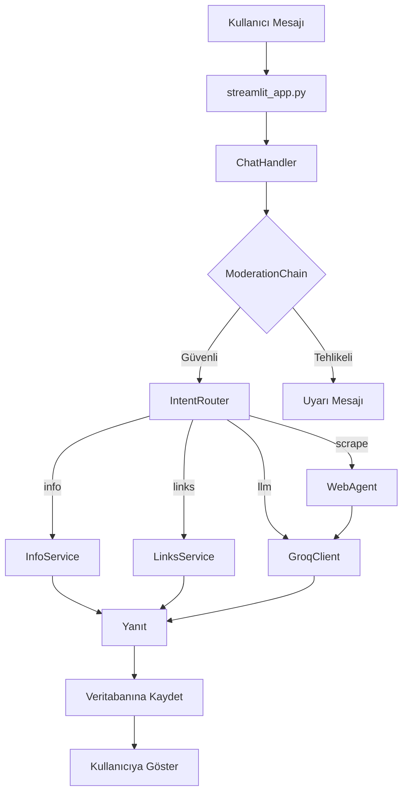

<div align="center">

# 🐝 Erciyes Yapay Zeka Kulübü Chatbot


**Yapay Zeka Kulübü için akıllı sohbet asistanı**

[](https://python.org)
[](https://streamlit.io)
[](https://groq.com)

</div>

---

## 🚀 Hızlı Başlangıç

### 1. Kurulum

```bash
# Projeyi klonla
git clone https://github.com/Yapay-Zeka-Kulubu/ClubChatBot.git
cd ClubChatBot

# Virtual environment oluştur
python -m venv venv
venv\Scripts\activate  # Windows
# source venv/bin/activate  # Linux/Mac

# Bağımlılıkları yükle
pip install -r requirements.txt
```

### 2. Ortam Değişkenleri

`.env` dosyası oluştur:

```env
GROQ_API_KEY=your_groq_api_key_here
```

### 3. Çalıştırma

```bash
streamlit run streamlit_app.py
```

Tarayıcıda `http://localhost:8501` adresinde açılacaktır.

---

## 📁 Proje Yapısı

```
ClubChatBot/
├── streamlit_app.py      # Ana uygulama giriş noktası
├── chat_handler.py       # Mesaj orkestrasyon (moderation, intent, LLM)
├── database.py           # SQLite veritabanı işlemleri
├── main.py               # Alternatif giriş noktası
│
├── frontend/             # UI bileşenleri
│   ├── __init__.py
│   ├── styles.py         # CSS stilleri (StyleManager)
│   ├── chat_manager.py   # Sohbet yönetimi (ChatManager)
│   └── views.py          # Görünüm bileşenleri (MainView)
│
├── config/
│   └── settings.py       # Uygulama ayarları ve API anahtarları
│
├── llm/
│   ├── llm_client.py     # Groq LLM istemcisi
│   └── prompt_builder.py # Prompt mühendisliği
│
├── moderation/           # İçerik güvenliği
│   ├── moderation_chain.py
│   ├── profanity_filter.py
│   ├── spam_filter.py
│   ├── toxicity_detector.py
│   └── safety_rules.py
│
├── router/
│   └── intent_router.py  # Mesaj yönlendirme (info, links, scrape, llm)
│
├── agents/               # Web scraping ajanları
│   ├── web_agent.py
│   └── scrapers/
│
├── info/                 # Statik kulüp bilgileri
│   ├── club_info.txt
│   ├── community_info.py
│   └── membership_info.py
│
├── links/                # URL yönetimi
│   ├── website_links.py
│   └── social_links.py
│
└── assets/               # Görsel dosyalar
    ├── logo.png
    ├── fav1.png
    └── avatar_user.png
```

---

## 🔄 Çalışma Akışı



---

## 🛡️ Güvenlik Katmanları

| Modül | Görev |
|-------|-------|
| `message_validator.py` | Format ve uzunluk kontrolü |
| `profanity_filter.py` | Küfür filtreleme |
| `spam_filter.py` | Spam ve tekrar tespiti |
| `toxicity_detector.py` | Toksisite analizi |
| `safety_rules.py` | Kişisel bilgi koruma |

---

## ⚙️ Yapılandırma

`config/settings.py` içindeki ayarlar:

| Ayar | Açıklama |
|------|----------|
| `GROQ_API_KEY` | Groq API anahtarı |
| `SITE_BASE` | Kulüp web sitesi URL'i |
| `USE_BROWSER_AGENT` | Web scraping aktif/pasif |
| `MAX_DAILY_MESSAGES` | Günlük mesaj limiti |
| `MAX_TOKENS` | LLM token limiti |

---

## 🤖 Desteklenen Modeller

- **Llama 3.3 70B** (varsayılan)
- **Llama 3.1 8B** (hızlı)
- **Mixtral 8x7B** (alternatif)

---

## 📚 Teknik Dokümantasyon

### Genel Çalışma Mantığı

1. `streamlit_app.py` kullanıcı arayüzünü yönetir
2. `ChatHandler` gelen mesajı alır, önce `ModerationChain`'e gönderir
3. Moderasyon temizse `IntentRouter` çağrılır → hangi servis kullanılacağı döner
4. `ChatHandler` ilgili servisi çağırır (InfoService, LinksService, WebAgent, GroqClient)
5. Gerekirse `PromptBuilder` ile LLM için prompt hazırlanır
6. Sonuç veritabanına kaydedilir ve kullanıcıya dönülür

### Intent Router Stratejileri

1. **Kural Tabanlı** (hızlı, bedava): Kelime eşleştirme
2. **ML Tabanlı** (orta): Küçük sklearn modeli
3. **LLM Tabanlı** (akıllı): Prompt ile sınıflandırma

### Memory Yönetimi

Seçenekler:
- LangChain `ConversationBufferWindowMemory` ile
- Veritabanından son N mesaj çekilerek

---

## 🧪 Test

```bash
# Agent testlerini çalıştır
python test_agents.py
```

---

## 📄 Lisans

Bu proje Erciyes Üniversitesi Yapay Zeka Kulübü tarafından geliştirilmektedir.

---

<div align="center">

**[🌐 Web Sitesi](https://erciyesyapayzeka.com.tr)** • 
**[📸 Instagram](https://instagram.com/eruaiclub)** • 
**[💼 LinkedIn](https://linkedin.com/company/erciyes-yapay-zeka)** • 
**[🐙 GitHub](https://github.com/Yapay-Zeka-Kulubu)**

</div>
